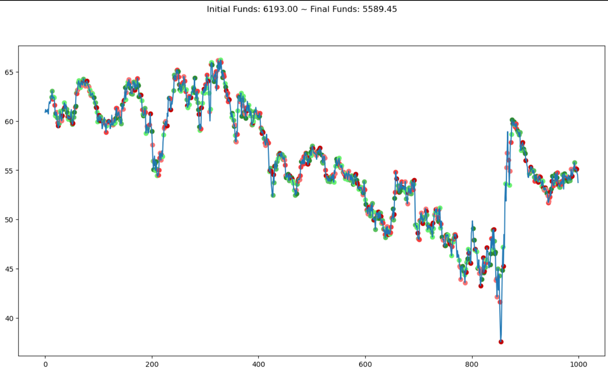

# Airtos - A Tensorflow Learning Environment for Trading of Stocks

Airtos stands for _Artificial Intelligence Robot for Trading Of Stocks_. It's a simple TF environment for training and testing AI agents for trading of stock shares. Airtos is based on the [gym-anytrading](https://github.com/AminHP/gym-anytrading) implementation, adding some extra features and complying to Tensorflow's environments interface. Airtos can be used with deep learning AI alrogithms such as DQN and PPO.

## Environment inputs
Airtos uses the [pandas-ta](https://twopirllc.github.io/pandas-ta/) package to compute technical indicators that serve as the main trading signals it uses to make a decision (compute an action).

You can add your own indicators by inheriting from the base [TradingEnv](./src/airtos/envs/trading_env.py) class and implementing your own logic for extracting the trading signals. For instance, the [MacdEnv](./src/airtos/envs/macd_env.py) class uses the famous MACD indicator.

## Environment actions
At any given step, Airtos allows the agent to pick from any of the following actions:

1. **NOOP**: do nothing
2. **WEAK BUY**: buy a few shares, invest ~5% of current budget
3. **REGULAR BUY**: buy some shares, invest ~10% of current budget
4. **STRONG BUY**: buy many shares, invest ~30% of current budget
5. **WEAK SELL**: sell a few shares, sell ~30% of current shares
6. **REGULAR SELL**: sell some shares, sell ~50% of current shares
7. **STRONG SELL**: sell all shares

Which one to take based on the current trading signals? Well, that's where the AI agents enter the game to compute the best decision based on the current inputs and experience (deep learning algorithms leverage past experience to make the best out of it).

## Environment testing and rendering
```
from airtos.envs import MacdEnv
from airtos.utils import load_dataset
from tf_agents.environments import tf_py_environment
from tf_agents.policies import random_tf_policy
import matplotlib.pyplot as plt

# Load the dataset in memory
df = load_dataset('./resources/KO.csv')

# Instantiate the environment, use MACD indicator
# Look at prices for the first 1000 days of the CSV
# Use a window of 10 trading signals
env = MacdEnv(df=df, window_size=10, frame_bound=(10, 1000))

eval_env = tf_py_environment.TFPyEnvironment(env)

# Helper function, go through an episode of the environment
def render_policy_eval(policy, filename):
    time_step = eval_env.reset()
    while not time_step.is_last():
        action_step = policy.action(time_step)
        time_step = eval_env.step(action_step.action)
    env.render('human')

random_policy = random_tf_policy.RandomTFPolicy(eval_env.time_step_spec(),
                                                eval_env.action_spec())

# Render environment
plt.figure(figsize=(15, 8))
render_policy_eval(random_policy, "random_agent")
```
